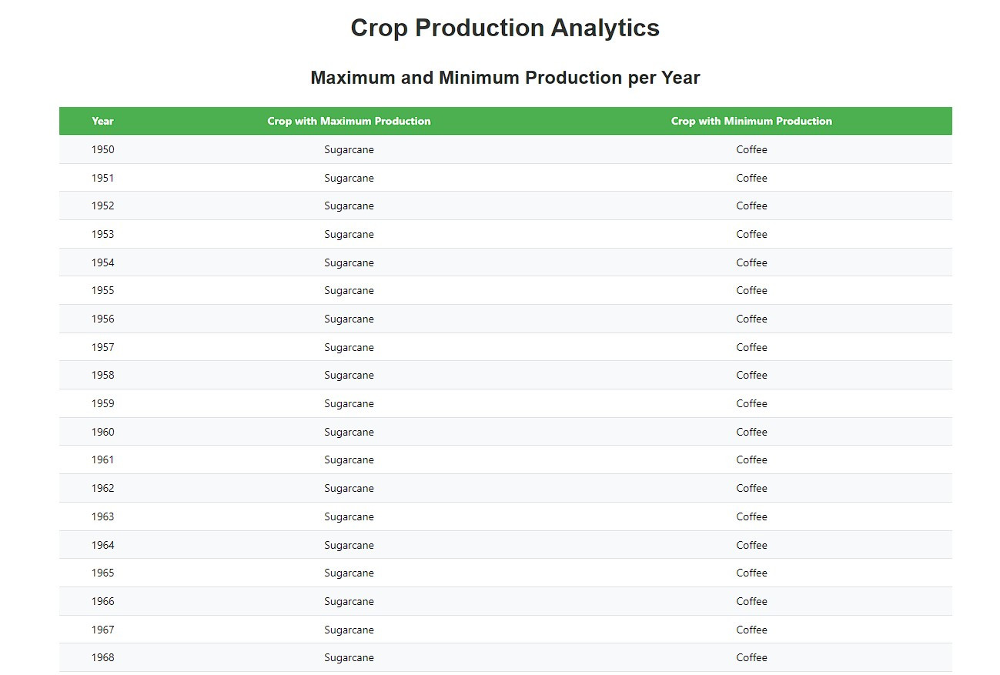
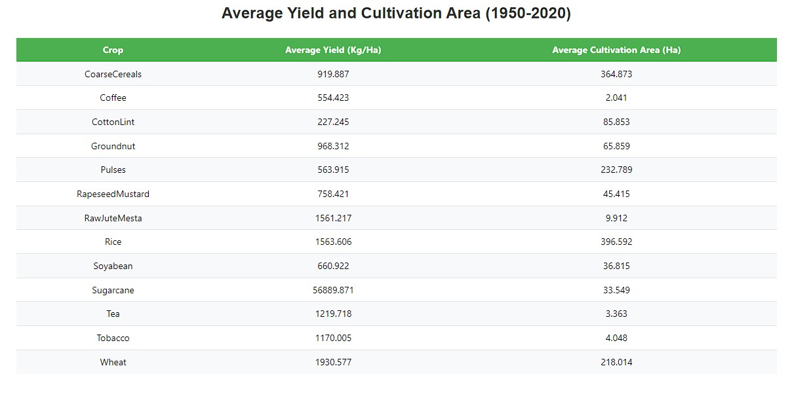

# Crop Production Analytics

This project displays analytics on crop production using data from 1950 to 2020. The analytics include maximum and minimum production per year and average yield and cultivation area.

## Maximum and Minimum Production per Year

The table below shows the crop with the maximum and minimum production for each year.

## Average Yield and Cultivation Area (1950-2020)

The table below displays the average yield and cultivation area for different crops over the years 1950 to 2020.

## Technologies Used

React

Mantine

JavaScript

CSS

## How to Run

yarn install

yarn start
